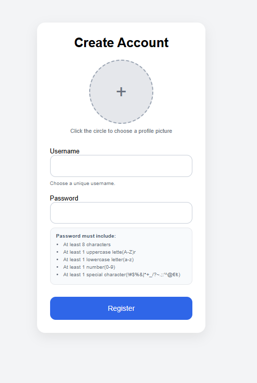
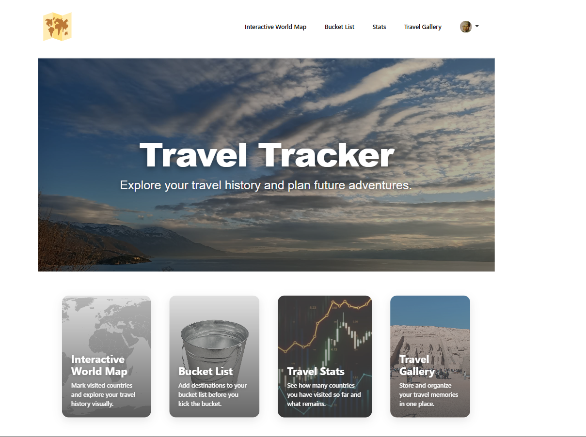
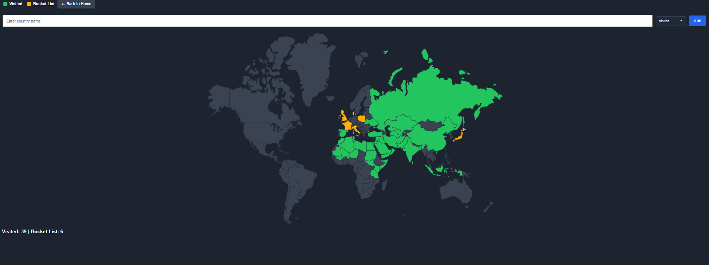
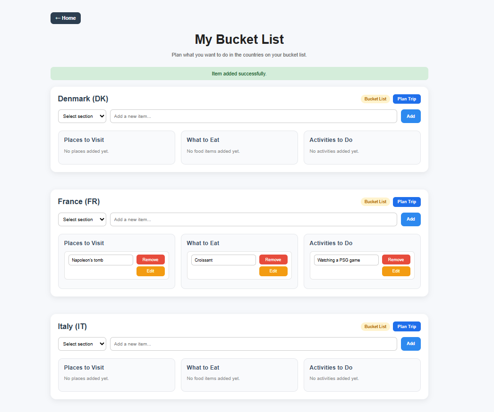
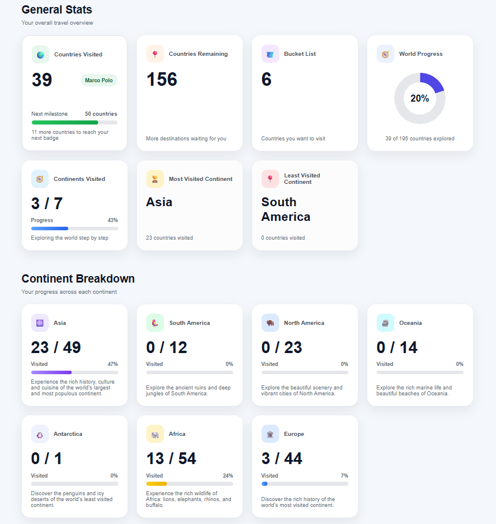
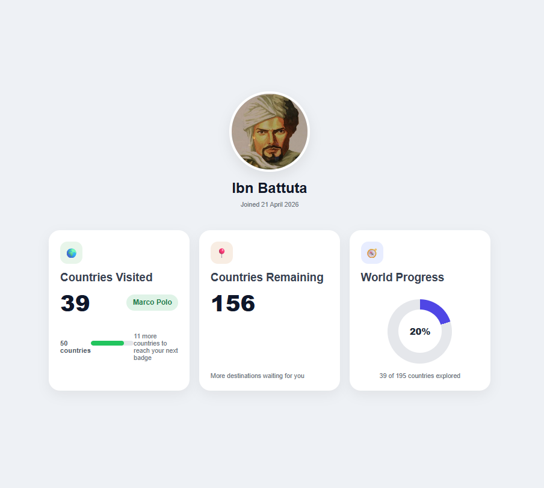
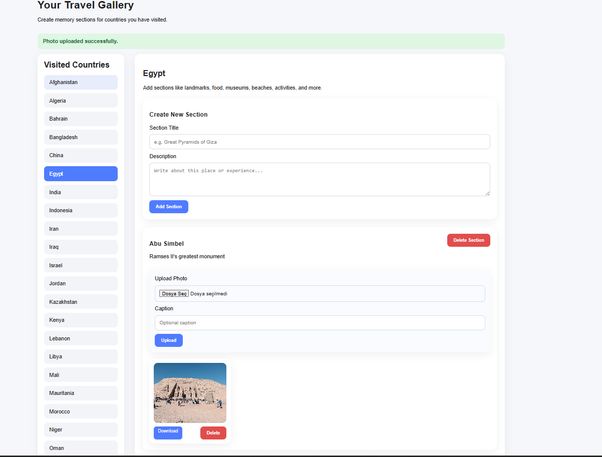
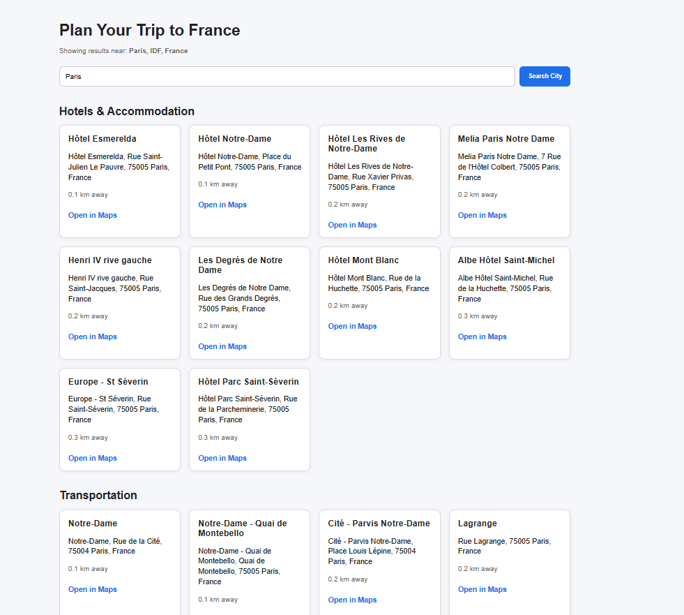

# Travel Tracker Web Application

Travel Tracker is a full-stack web application that allows users to register, log in, track the countries they have visited, manage a bucket list of countries they want to visit, view travel statistics, create photo galleries for visited countries, and use a travel planner to find hotels, transport options, and attractions for selected destinations.

The application uses Node.js, Express.js, PostgreSQL, EJS templates, user sessions, file uploads, and the Geoapify API. It was developed to practice full-stack web development concepts such as authentication, database relationships, dynamic page rendering, REST-style routing, image upload handling, and API integration.

## Features

* User registration and login with bcrypt password hashing
* Session-based authentication and flash messages
* World map for tracking visited and bucket-list countries
* Add, remove, and manage visited/bucket-list countries
* Bucket-list planner with places to visit, foods to try, and activities to do
* Travel statistics with world progress, continent progress, remaining countries, and explorer levels
* User profile page displaying personal travel progress
* Photo gallery for visited countries with sections, captions, uploads, downloads, and delete options
* Travel planner using Geoapify API to find hotels, transport options, and attractions near a searched city
* PostgreSQL database integration for users, countries, bucket-list items, gallery sections, and photos
* Dynamic frontend pages using EJS and custom CSS styling


## Technologies Used

* Node.js
* Express.js
* EJS
* PostgreSQL
* bcrypt
* dotenv
* Multer
* Axios
* Body Parser
* Geoapify API
* HTML
* CSS
* JavaScript

## Purpose of the Project

The main purpose of this project was to improve my full-stack web development skills by building a complete travel tracking application.

Through this application, I practiced user authentication, password hashing, session management, PostgreSQL database operations, dynamic page rendering with EJS, file upload handling, image gallery management, travel statistics calculation, and external API integration using Geoapify.

The project also helped me practice organizing a larger Express.js application with multiple features such as a world map, bucket list, travel statistics, photo gallery, and travel planner.

## Interfaces

### Registration Page

The registration page allows new users to create an account. It includes password validation rules such as minimum length, uppercase letters, lowercase letters, numbers, and special characters. Passwords are hashed using bcrypt before being stored in the PostgreSQL database.



### Login Page

The login page allows registered users to sign in. During login, the application compares the entered password with the hashed password stored in the database.


### Home Page

The home page acts as the main navigation page after login. From this page, users can access the world map, bucket list, travel statistics, profile, photo gallery, and travel planner features.



### World Map Page

The world map page displays the user's visited countries and bucket-list countries. Visited countries and bucket-list countries are shown differently on the map so the user can visually track their travel progress.

Users can add a country to either the visited list or bucket list. If a country is moved from bucket list to visited, it is removed from the bucket list to prevent duplicates.



### Bucket List Page

The bucket-list page displays countries the user wants to visit, as well as visited countries that are still visible on the bucket-list page. For each country, the user can add planning items such as places to visit, foods to try, and activities to do.

Users can also edit or delete individual bucket-list items.



### Travel Statistics Page

The travel statistics page displays the user's travel progress. It includes the number of visited countries, bucket-list countries, countries remaining, world progress percentage, continent statistics, and explorer level.



### Profile Page

The profile page displays user information and travel statistics. It gives the user a personal overview of their progress inside the application.



### Photo Gallery Page

The photo gallery page allows users to view their visited countries and create gallery sections for each visited country. Users can upload photos, add captions, delete photos, delete sections, and download uploaded images.

Gallery sections can only be created for countries that the user has marked as visited.



### Travel Planner Page

The travel planner page allows users to search for a city inside a selected country. The application uses Geoapify to find the city location, then recommends nearby hotels, transport options, and tourist attractions within a 15 km radius.

Each recommendation includes useful information such as name, address, distance, and a Google Maps link.



## How It Works

1. The user registers a new account or logs in.
2. The user opens the world map page.
3. The user adds countries to either the visited list or the bucket list.
4. The application stores the selected country and list type in PostgreSQL.
5. The world map displays visited and bucket-list countries with different colors.
6. The user can open the bucket-list page.
7. The user can add places, foods, and activities for each country.
8. The user can view travel statistics based on visited countries.
9. The user can open the gallery page and select a visited country.
10. The user can create gallery sections and upload photos.
11. The uploaded image files are stored in the uploads folder.
12. The image path and caption are stored in PostgreSQL.
13. The user can view or download photos from the gallery.
14. The user can open the travel planner for a country.
15. The user enters a city.
16. Geoapify converts the city and country into latitude and longitude.
17. Geoapify searches for hotels, transport options, and attractions nearby.
18. The application displays the recommendations on the travel planner page.

## Travel Statistics Logic

The application calculates several travel statistics for each user:

* Number of countries visited
* Number of countries in the bucket list
* Total number of countries
* Number of countries remaining
* World progress percentage
* Continent progress
* Number of continents visited
* Most visited continent
* Least visited continent
* Explorer level

The world progress percentage is calculated using:

```js
Math.round((countriesVisited / totalCountries) * 100)
```

The continent progress percentage is calculated using:

```js
Math.round((visited / total) * 100)
```

The explorer level is based on the number of visited countries. For example, users start as a Novice Traveler and progress through higher levels as they visit more countries.

## Gallery Logic

The photo gallery is connected to visited countries. A user can only create gallery sections for countries that are already in their visited list.

Each gallery section belongs to:

* A user
* A country
* A title
* A description

Each photo belongs to a gallery section and stores:

* Image path
* Caption
* Upload date

The actual uploaded image file is stored inside:

```text
public/uploads/
```

The database stores the image path, not the image file itself.

## Travel Planner Logic

The travel planner uses the Geoapify API.

First, the selected city and country are combined into a search text:

```js
city + ", " + countryName
```

Then Geoapify Geocoding API converts the destination into:

* Latitude
* Longitude
* Formatted address

After that, Geoapify Places API searches within a 15 km radius for:

* Hotels, hostels, and guest houses
* Airports, train stations, bus stations, and subway stations
* Tourist attractions and sights

The application formats the returned Geoapify data into a readable object containing:

* Name
* Address
* Latitude
* Longitude
* Distance
* Google Maps link

## Project Structure

```text
Travel-Tracker-Web-Application/
│
├── images/
│   ├── registration.png
│   ├── login.png
│   ├── home.png
│   ├── worldmap.png
│   ├── bucketlist.png
│   ├── travelstats.png
│   ├── profile.png
│   ├── gallery.png
│   └── travel-planner.png
│
├── public/
│   ├── uploads/
│   ├── assets/
│   ├── css/
│   └── images/
│
├── views/
│   ├── registration.ejs
│   ├── login.ejs
│   ├── home.ejs
│   ├── worldmap.ejs
│   ├── bucketlist.ejs
│   ├── travelstats.ejs
│   ├── profile.ejs
│   ├── gallery.ejs
│   └── travel-planner.ejs
│
├── .env.example
├── .gitignore
├── package.json
├── package-lock.json
└── index.js
```

## Installation

### 1. Clone the repository

```bash
git clone https://github.com/your-username/Travel-Tracker-Web-Application.git
cd Travel-Tracker-Web-Application
```

### 2. Install dependencies

```bash
npm install
```

### 3. Create the PostgreSQL database

Create a PostgreSQL database for the project.

```sql
CREATE DATABASE travel_tracker;
```

### 4. Create the required tables

```sql
CREATE TABLE users (
    id SERIAL PRIMARY KEY,
    username VARCHAR(255) UNIQUE NOT NULL,
    password VARCHAR(255) NOT NULL,
    profile_image TEXT,
    registration_date TIMESTAMP DEFAULT NOW()
);

CREATE TABLE countries (
    country_code VARCHAR(10) PRIMARY KEY,
    country_name VARCHAR(255) NOT NULL,
    continent VARCHAR(100),
    counts_in_stats BOOLEAN DEFAULT TRUE
);

CREATE TABLE user_country_lists (
    id SERIAL PRIMARY KEY,
    user_id INTEGER REFERENCES users(id) ON DELETE CASCADE,
    country_code VARCHAR(10) REFERENCES countries(country_code) ON DELETE CASCADE,
    list_type VARCHAR(20) NOT NULL,
    hide_from_bucketlist BOOLEAN DEFAULT FALSE,
    created_at TIMESTAMP DEFAULT NOW(),
    UNIQUE(user_id, country_code, list_type)
);

CREATE TABLE country_bucket_items (
    id SERIAL PRIMARY KEY,
    user_id INTEGER REFERENCES users(id) ON DELETE CASCADE,
    country_code VARCHAR(10) REFERENCES countries(country_code) ON DELETE CASCADE,
    section VARCHAR(50) NOT NULL,
    item_text TEXT NOT NULL,
    created_at TIMESTAMP DEFAULT NOW()
);

CREATE TABLE gallery_sections (
    id SERIAL PRIMARY KEY,
    user_id INTEGER REFERENCES users(id) ON DELETE CASCADE,
    country_code VARCHAR(10) REFERENCES countries(country_code) ON DELETE CASCADE,
    title VARCHAR(255) NOT NULL,
    description TEXT,
    created_at TIMESTAMP DEFAULT NOW()
);

CREATE TABLE gallery_photos (
    id SERIAL PRIMARY KEY,
    section_id INTEGER REFERENCES gallery_sections(id) ON DELETE CASCADE,
    image_path TEXT NOT NULL,
    caption TEXT,
    created_at TIMESTAMP DEFAULT NOW()
);
```

### 5. Insert country data

The application requires country data in the `countries` table.

Each country should include:

* `country_code`
* `country_name`
* `continent`
* `counts_in_stats`

Example:

```sql
INSERT INTO countries (country_code, country_name, continent, counts_in_stats)
VALUES
('TR', 'Turkey', 'Asia', TRUE),
('FR', 'France', 'Europe', TRUE),
('JP', 'Japan', 'Asia', TRUE);
```

For full functionality, insert the full list of countries used by your world map.

### 6. Configure environment variables

Create a `.env` file in the root directory of the project.

```env
DB_USER=postgres
DB_HOST=localhost
DB_NAME=travel_tracker
DB_PASSWORD=your_postgresql_password_here
DB_PORT=5432

SESSION_SECRET=your_session_secret_here

GEOAPIFY_API_KEY=your_geoapify_api_key_here
```

Also include a `.env.example` file with placeholder values so other users know which variables are required.

```env
DB_USER=your_database_user
DB_HOST=localhost
DB_NAME=your_database_name
DB_PASSWORD=your_database_password
DB_PORT=5432

SESSION_SECRET=your_session_secret

GEOAPIFY_API_KEY=your_geoapify_api_key
```

## Git Ignore

The project should include a `.gitignore` file to prevent private or unnecessary files from being uploaded.

```gitignore
node_modules/
.env
uploads/
public/uploads/
```

This prevents GitHub from uploading dependencies, environment variables, and uploaded user images.

## Running the Application

Start the application with:

```bash
npm start
```

If there is no start script, run:

```bash
node index.js
```

Then open the application in your browser:

```text
http://localhost:3000
```

## Usage

1. Register a new account.
2. Log in with your account.
3. Open the world map page.
4. Add countries to your visited list or bucket list.
5. Open the bucket-list page.
6. Add places, foods, and activities for countries.
7. Open the travel statistics page to view your progress.
8. Open the gallery page.
9. Select a visited country.
10. Create a gallery section.
11. Upload photos and captions.
12. Download gallery photos when needed.
13. Open the travel planner from a country page.
14. Enter a city.
15. View nearby hotels, transport options, and attractions.

## Sample Use Case

Example use case:

* Register and log in.
* Add Turkey to visited countries.
* Add Japan to the bucket list.
* Open the bucket-list page and add activities for Japan.
* Open the gallery page and create a section for Turkey.
* Upload photos from a trip to Istanbul.
* Open the travel planner for Japan.
* Search for Tokyo.
* View hotels, transport options, and attractions near Tokyo.

## Future Improvements

Possible future improvements include:

* Adding search and filters for the photo gallery
* Allowing users to edit gallery section titles and descriptions
* Adding badges and achievements
* Adding map markers for gallery photos
* Adding weather information to the travel planner
* Adding saved travel planner recommendations
* Deploying the application online
